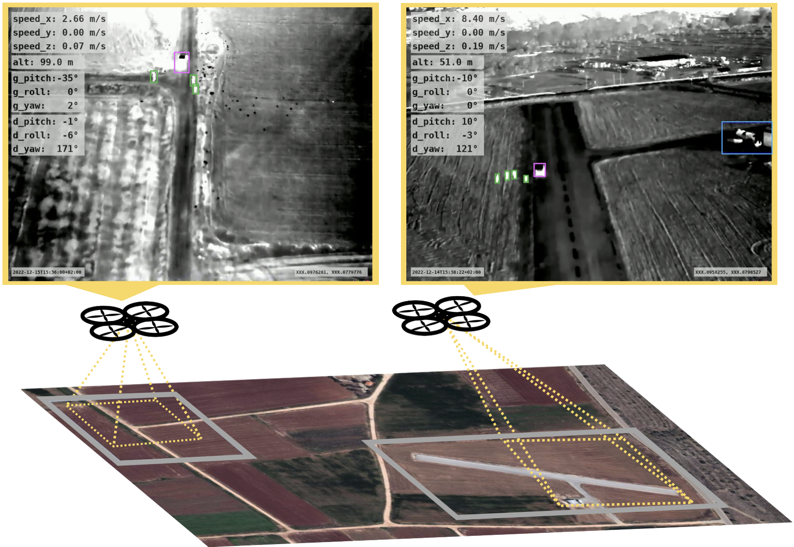

# The MONET dataset: Multimodal drone thermal dataset recorded in rural scenarios
MONET is a multimodal dataset captured using a thermal camera mounted on a drone that flew over rural areas, and recorded human and vehicle activities. We captured MONET to study the problem of object localisation and behaviour understanding of targets undergoing large-scale variations and being recorded from different and moving viewpoints. Target activities occur in two different land sites, each with unique scene structures and cluttered backgrounds. MONET consists of approximately 53K images featuring 162K manually annotated bounding boxes. Each image is timestamp-aligned with drone metadata that includes information about attitudes, speed, altitude, and GPS coordinates. MONET is different from previous thermal drone datasets because it features multimodal data, including rural scenes captured with thermal cameras containing both person and vehicle targets, along with trajectory information and metadata.

<p align="center"></p>

[MONET dirtroad video example (youtube)](https://youtu.be/_j7DaS2d3nY)

[MONET runway video example (youtube)](https://youtu.be/jGL4CvBIPC4)

## Training data

[Download link](https://fbk-my.sharepoint.com/:f:/g/personal/poiesi_fbk_eu/Ep7luptKPA1Po6cp4EKLrm4BsgbZGrZjDnynPwvrv3NGOA?e=bcPyYu)

## Citing our work
Please cite the following paper if you use our code

```latex
@inproceedings{Riz2023,
  title = {Distinctive {3D} local deep descriptors},
  author = {Riz, Luigi and Caraffa, Andrea and Bortolon, Matteo and Mekhalfi, Mohamed Lamine and Boscani, Davide and Moura, Andr\'e and Antunes, Jos\'e and Dias, Andr\'e and Silva, Hugo and Leonidou, Andreas and Constantinides, Christos and Keleshis, Christos and Abate, Dante and Poiesi, Fabio},
  booktitle = {IEEE Proc. of the IEEE/CVF Computer Vision and Pattern Recognition (CVPR) Workshops},
  address = {Vancouver, CA}
  month = {Jun}
  year = {2023}
}
```

## Acknowledgements

This work was carried out within the scope of the SHIELD project that received funding from the European Union’s Joint Programming Initiative – Cultural Heritage, Conservation, Protection and Use joint call.
